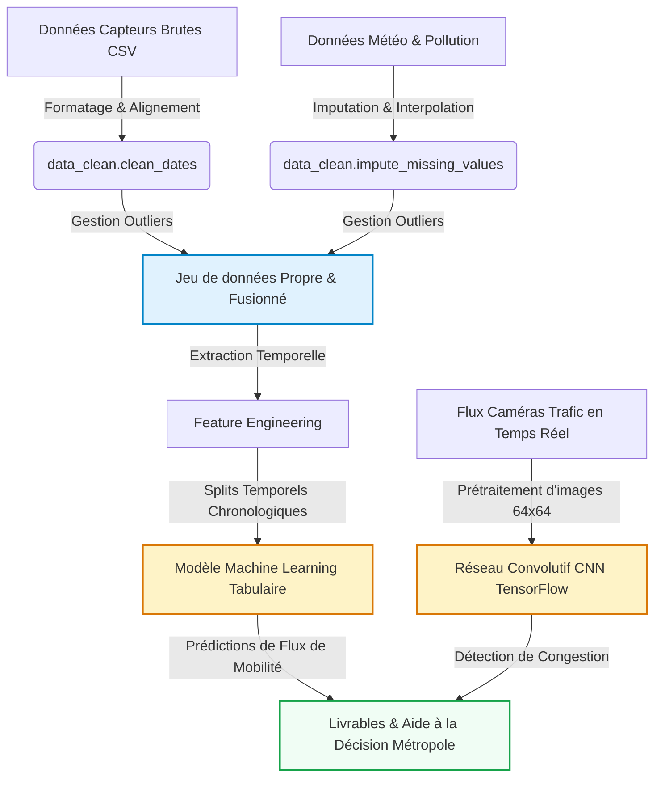

# Introduction et Contexte Métier {#sec-intro}

*À rédiger par les étudiants : Présentez ici le contexte global du projet de transition écologique de la métropole, les enjeux sociétaux de la mobilité active, les questions scientifiques soulevées et la problématique métier que vous cherchez à résoudre.*

## Contexte du Projet
*À rédiger par les étudiants — Pistes de réflexion :*
- *Quels sont les objectifs environnementaux globaux de la métropole en matière de réduction d'empreinte carbone et de pollution ?*
- *En quoi la promotion de la mobilité active (vélo) et des transports en commun (bus) constitue-t-elle un levier d'action stratégique ?*
- *Pourquoi l'analyse quantitative des données de trafic est-elle indispensable pour piloter les infrastructures urbaines ?*

[Rédiger votre paragraphe de contexte ici]

## Objectif Analytique
*À rédiger par les étudiants — Pistes de réflexion :*
- *Quelles sont les variables cibles principales (ex: bike_count) et la tâche prédictive globale ?*
- *Comment le couplage de données physiques (météo, pollution, trafic) et d'images (brique de vision CNN) permet-il d'adopter une approche multi-sources ?*
- *Quels sont les livrables analytiques attendus pour aider la métropole dans ses prises de décisions stratégiques ?*

[Rédiger votre paragraphe d'objectifs ici]

---

# Acquisition et Préparation des Données (Data Wrangling) {#sec-wrangling}

Le succès de tout projet de Data Science repose sur la qualité de la préparation des données [@pandas2020]. Cette section documente l'audit de qualité et les étapes de nettoyage appliquées au jeu de données de capteurs brut.

## Audit de Qualité
*À rédiger par les étudiants : Présentez un audit critique complet du fichier de données brutes. Indiquez la liste des anomalies physiques et typologiques détectées (formats de dates, outliers physiques, taux de valeurs manquantes).*

[Rédiger votre audit de données ici]

## Algorithme de Nettoyage
*À rédiger par les étudiants : Justifiez et détaillez l'enchaînement de vos opérations de traitement (uniformisation des dates, masquage des outliers physiques par NaN, imputation temporelle). Faites référence aux fonctions correspondantes de votre module `src/data_clean.py`.*

[Rédiger la justification méthodologique ici]

## Travaux Pratiques de Wrangling


---

# Analyse Exploratoire des Données (EDA) {#sec-eda}

Dans cette section, nous analysons les relations statistiques fondamentales qui régissent la mobilité active (vélos) et les transports en commun (bus) au sein de la métropole.

## Statistiques Descriptives
*À rédiger par les étudiants : Présentez une vue d'ensemble descriptive rapide de vos variables nettoyées.*

[Rédiger les statistiques descriptives ici]

## Ingénierie de Variables (Feature Engineering)
*À rédiger par les étudiants : Expliquez l'intérêt mathématique et l'impact sur les modèles prédictifs d'extraire des composantes temporelles cycliques (comme l'encodage sinus / cosinus des heures).*

[Rédiger votre explication de l'ingénierie de variables ici]

## Travaux Pratiques d'Exploration Visuelle (EDA)


---

# Visualisation Multidimensionnelle (Insights) {#sec-viz}

Nous présentons ici les résultats visuels clés permettant de dégager des insights exploitables pour les décideurs publics, en s'appuyant sur notre module `src/utils_viz.py`.

*À rédiger par les étudiants : Présentez et commentez en détail vos 3 à 5 insights majeurs découverts lors de l'exploration descriptive visuelle. Intégrez et justifiez les figures clés générées.*

## Profils d'Activité Journalière
```python
#| label: fig-traffic-density
#| fig-cap: "Profil horaire moyen des déplacements (Vélos vs Bus)."
#| echo: false
# TODO: Utiliser uv.plot_traffic_density() de votre module pour tracer la figure
```
[Commenter la figure et décrire vos observations ici]

## Corrélations Globales
```python
#| label: fig-correlation
#| fig-cap: "Matrice de corrélation de Spearman entre variables."
#| echo: false
# TODO: Utiliser uv.plot_correlation_matrix() de votre module pour tracer la figure
```
[Commenter la figure et décrire vos observations ici]

---

# Modélisation et Apprentissage {#sec-modelling}

## Schéma Global du Pipeline de Données
Le pipeline complet intègre à la fois la branche analytique tabulaire (Machine Learning) et la branche d'analyse visuelle (Deep Learning CNN) :



## Modélisation Tabulaire (Prédiction Vélos)
*À rédiger par les étudiants : Expliquez le choix de votre algorithme d'apprentissage supervisé (Forêt Aléatoire) et décrivez l'importance des variables explicatives.*

[Détailler votre modélisation ici]

### Travaux Pratiques de Modélisation Tabulaire


## Modélisation Vision (Analyse d'Images)
*À rédiger par les étudiants : Expliquez l'intérêt de la brique de Deep Learning d'images pour classifier le trafic. Détaillez l'architecture de votre réseau de neurones convolutif (CNN) conçu sous TensorFlow/Keras [@cnn_traffic2023] (conv, pooling, dense, dropout, activation) et commentez les courbes d'apprentissage obtenues.*

[Détailler votre architecture CNN et analyse ici]

### Travaux Pratiques de Vision par Ordinateur (CNN)


---

# Évaluation Métrique et Validation {#sec-evaluation}

## Stratégie de Validation Chronologique
*À rédiger par les étudiants : Expliquez pourquoi un découpage d'évaluation aléatoire classique violerait le principe de causalité temporelle et comment vous avez configuré une validation temporelle rigoureuse.*

[Rédiger la section de validation ici]

## Résultats et Interprétation
*À rédiger par les étudiants : Complétez le tableau d'évaluation ci-dessous en reportant vos résultats de modélisation.*

| Modèle | MAE (cyclistes) | RMSE (cyclistes) | $R^2$ (%) |
|--------|-----------------|------------------|-----------|
| Baseline Historique | [À compléter] | [À compléter] | [À compléter] |
| **Forêt Aléatoire** | **[À compléter]** | **[À compléter]** | **[À compléter]** |

[Interpréter et comparer les métriques d'erreur calculées ici]

---

# Data Storytelling et Communication {#sec-storytelling}

## Recommandations pour la Métropole
*À rédiger par les étudiants : Formulez des recommandations stratégiques, opérationnelles et innovantes pour aider les décideurs publics sur la base de vos découvertes analytiques et prédictives.*

[Rédiger vos recommandations ici]

## Limites et Perspectives
*À rédiger par les étudiants : Identifiez honnêtement les biais ou limites de votre approche et proposez des pistes d'amélioration futures (ex: intégration de données externes réelles, modélisation plus poussée).*

[Rédiger les limites et perspectives ici]

Ce document dynamique a été compilé en Quarto [@quarto2024].

---

# Bibliographie {.unnumbered}

::: {#refs}
:::
