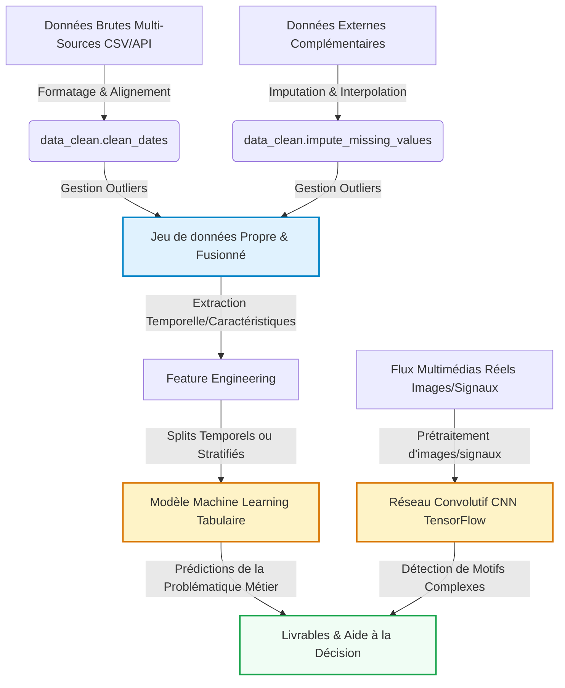

# Introduction et Contexte Métier {#sec-intro}

Ce projet s’inscrit dans une démarche d’analyse de données appliquée au marché des ordinateurs portables. Le jeu de données utilisé contient différentes caractéristiques techniques et commerciales de laptops, telles que la marque, le type de machine, la taille de l’écran, le processeur, la mémoire vive, le stockage, le système d’exploitation, le poids et le prix.

L’objectif principal est d’étudier ces données afin de comprendre les facteurs qui influencent le prix d’un ordinateur portable. Pour cela, le projet suivra plusieurs étapes : le nettoyage des données, l’analyse exploratoire, la visualisation, puis éventuellement la mise en place d’un modèle prédictif permettant d’estimer le prix d’un ordinateur à partir de ses caractéristiques.

## Contexte du Projet

Le marché des ordinateurs portables est très concurrentiel et propose une grande variété de produits. Les prix peuvent varier fortement selon les composants, la marque ou encore l’usage visé : bureautique, gaming, professionnel, ultraportable, etc. Pour un consommateur, il n’est pas toujours simple de comprendre quels éléments justifient réellement un prix plus élevé.

Dans ce contexte, l’analyse quantitative du jeu de données permet d’identifier les caractéristiques qui ont le plus d’impact sur le prix. Elle peut aider à mieux comparer les produits, à comprendre les tendances du marché et à faciliter la prise de décision. Par exemple, on peut chercher à savoir si la quantité de RAM, la présence d’un SSD, la gamme du processeur ou la résolution de l’écran influencent fortement le prix.

Ce projet soulève donc une problématique métier concrète : comment exploiter les caractéristiques techniques d’un ordinateur portable pour comprendre et prédire son prix ? Cette analyse peut être utile à la fois pour les consommateurs, les revendeurs ou les entreprises souhaitant positionner leurs produits de manière plus pertinente.

## Objectif Analytique
*À rédiger par les étudiants — Pistes de réflexion :*

- *Quelles sont les variables cibles principales et la tâche globale de modélisation (classification, régression, clustering, etc.) ?*
- *Comment le couplage de données multi-sources et l'intégration de différents types de données (tabulaires, images, signaux, etc.) enrichissent-ils l'analyse ?*
- *Quels sont les livrables analytiques attendus pour répondre à votre problématique et guider les prises de décisions ?*

[Rédiger votre paragraphe d'objectifs ici]

---

# Acquisition et Préparation des Données (Data Wrangling) {#sec-wrangling}

Le succès de tout projet de Data Science repose sur la qualité de la préparation des données [@pandas2020]. Cette section documente l'audit de qualité et les étapes de nettoyage appliquées à vos jeux de données bruts.

## Chapitre 1 : Acquisition Multi-Sources


## Chapitre 2 : Nettoyage et Préparation (Wrangling)


---

# Visualisation Multidimensionnelle (Insights) {#sec-viz}

Nous présentons ici les résultats visuels clés permettant de dégager des insights exploitables pour les décideurs, en s'appuyant sur notre module `src/utils_viz.py`.

## Chapitre 3 : Travaux Pratiques d'Exploration Visuelle


---

# Analyse Exploratoire des Données (EDA) {#sec-eda}

Dans cette section, nous analysons les relations statistiques fondamentales qui régissent votre domaine d'étude au sein du jeu de données.

## Chapitre 4 : Travaux Pratiques d'Exploration (EDA)


---

# Modélisation et Apprentissage {#sec-modelling}

Le pipeline complet intègre à la fois la branche analytique tabulaire (Machine Learning) et la branche d'analyse visuelle ou de signaux complexes (Deep Learning CNN) :



## Chapitre 5 : Travaux Pratiques de Modélisation (ML & DL)


---

# Évaluation Métrique et Validation {#sec-evaluation}

## Chapitre 6 : Travaux Pratiques d'Évaluation & Robustesse


---

# Data Storytelling et Communication {#sec-storytelling}

## Chapitre 7 : Travaux Pratiques de Storytelling


## Présentation des Résultats (Livrables Interactifs)

::: {.panel-tabset}

### 📺 Diaporama de Soutenance (RevealJS)
Ci-dessous est intégré le squelette de votre diaporama de soutenance RevealJS. Utilisez-le pour présenter votre démarche aux décideurs de façon professionnelle.

<iframe src="slides.html" width="100%" height="500px" style="border: 1px solid #e2e8f0; border-radius: 8px; background: white;"></iframe>

### 📊 Exemple de Dashboard Dynamique (OJS / Plotly)
::: {.content-visible unless-format="pdf"}
Voici un exemple minimal de code montrant comment intégrer un graphique dynamique contrôlé par un composant d'interface utilisateur en Observable JS (OJS).

```{ojs}
//| echo: true
// Boutons de sélection interactifs OJS
viewof selectedCategory = Inputs.select(["Toutes", "A", "B", "C"], {value: "Toutes", label: "Filtrer par Catégorie :"})
```

```{ojs}
//| echo: false
// Données simulées réactives
data = [
  {timestamp: "2026-05-18T00:00:00Z", value: 10.5, category: "A"},
  {timestamp: "2026-05-18T02:00:00Z", value: 12.1, category: "A"},
  {timestamp: "2026-05-18T04:00:00Z", value: 14.7, category: "A"},
  {timestamp: "2026-05-18T05:00:00Z", value: 15.2, category: "A"},
  {timestamp: "2026-05-18T06:00:00Z", value: 16.0, category: "B"},
  {timestamp: "2026-05-18T07:00:00Z", value: 18.3, category: "B"},
  {timestamp: "2026-05-18T09:00:00Z", value: 21.5, category: "B"},
  {timestamp: "2026-05-18T10:00:00Z", value: 22.0, category: "B"},
  {timestamp: "2026-05-18T12:00:00Z", value: 25.4, category: "C"},
  {timestamp: "2026-05-18T13:00:00Z", value: 26.1, category: "C"},
  {timestamp: "2026-05-18T15:00:00Z", value: 28.9, category: "C"},
  {timestamp: "2026-05-18T16:00:00Z", value: 30.2, category: "C"}
]

// Filtrage réactif de la donnée
filteredData = selectedCategory === "Toutes" 
  ? data 
  : data.filter(d => d.category === selectedCategory)

// Tracé interactif avec la librairie Plotly
Plotly.newPlot('dynamic-chart', [{
  x: filteredData.map(d => d.timestamp),
  y: filteredData.map(d => d.value),
  type: 'scatter',
  mode: 'lines+markers',
  marker: {color: '#1A73E8', size: 8},
  line: {shape: 'spline', color: '#1A73E8', width: 3}
}], {
  title: 'Évolution Dynamique des Valeurs (Filtrée)',
  margin: {t: 50, b: 50, l: 50, r: 50},
  paper_bgcolor: 'rgba(0,0,0,0)',
  plot_bgcolor: 'rgba(0,0,0,0)',
  xaxis: {gridcolor: '#E5E7EB'},
  yaxis: {gridcolor: '#E5E7EB'}
})
```

::: {#dynamic-chart style="width:100%; height:400px; background: white; border-radius: 8px; box-shadow: 0 4px 6px -1px rgba(0,0,0,0.1);"}
:::
:::

:::

---

# Utilisation de l'Intelligence Artificielle {#sec-ai}

Dans une démarche de transparence scientifique et académique, cette section détaille la manière dont les outils d'Intelligence Artificielle (IA) générative ont été intégrés tout au long de la réalisation de ce projet.

## Cartographie de l'utilisation de l'IA

| Outil d'IA | Cas d'usage (Pourquoi ?) | Méthode d'utilisation (Comment ?) | Rôle et Validation Humaine |
| :--- | :--- | :--- | :--- |
| **ChatGPT** | *Explication de notions* | *sur le navigateur* | *Croisement avec le cours* |

## Principes de Rigueur et Responsabilité

1. **Responsabilité intellectuelle** : L'équipe assume l'entière responsabilité des analyses, des choix de modèles et des conclusions présentées dans ce rapport.
2. **Lutte contre les hallucinations** : Chaque suggestion technique a fait l'objet d'une validation empirique.
3. **Protection des données** : Aucun jeu de données confidentiel ou sensible n'a été soumis à des modèles tiers en ligne.

---

# Bibliographie {.unnumbered}

::: {#refs}
:::